<h1 align="center"> <👋 Hello, World! /></h1>

<!--
**f-is-h/f-is-h** is a ✨ _special_ ✨ repository because its `README.md` (this file) appears on your GitHub profile.

Here are some ideas to get you started:

- 🔭 I'm currently working on ...
- 🌱 I'm currently learning ...
- 👯 I'm looking to collaborate on ...
- 🤔 I'm looking for help with ...
- 💬 Ask me about ...
- 📫 How to reach me: ...
- 😄 Pronouns: ...
- ⚡ Fun fact: ...
-->

<div align="center">
  <table>
    <tr>
      <td valign="top" width="40%">
        
        <details open>
          <summary></summary>
            πάντες ἄνθρωποι θνητοί εἰσιν
        </details>
      </td>
      <td valign="top" width="60%">
        <div>
          
        </div>
        <div>
          
        </div>

```
    __           _                  _     
   / _|         (_)                | |    
 _| |_           _    ___          | |__  
|_|  _|  |---|  | |  / __|  |---|  | '_ \ 
  | |           | |  \__ \         | | | |
  |_|           |_|  |___/         |_| |_|
```

  </table>
</div>